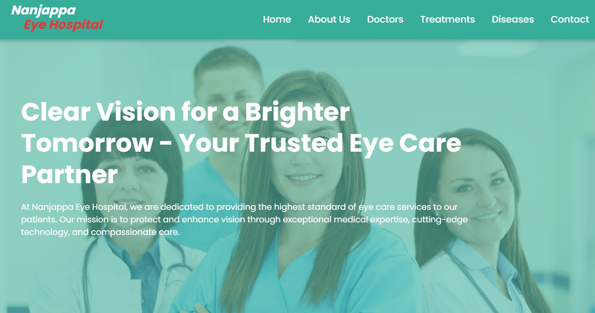

<h2 align="center">

 
  <a href="https://bankdash.com" target="_blank">BankDash</a>
</h2>

  

<h1 align="center" style="font-size: 3em;">BankDash 🔒📊</h1>

  Welcome to <strong>BankDash</strong>! A secure platform that offers OTP-based authentication and a powerful analytics dashboard. Designed to enhance user security and provide insightful data visualizations, BankDash is perfect for businesses and developers looking to integrate secure authentication and data tracking.

 

 &nbsp;
 &nbsp;
 &nbsp;
 &nbsp;

                

<h3 align="center">
    🔹
    <a href="https://github.com/Amol5766/BankDash/issues/new">💡 Submit an Issue</a> &nbsp; &nbsp;
    🔹
    <a href="https://github.com/Amol5766/BankDash/pulls">🚀 Request a Feature</a>
</h3>

## TL;DR

You can fork this repo to modify and make changes of your own. Please give me proper credit by linking back to [Amol5766](https://github.com/Amol5766/BankDash). Thanks!

<h2>🔐 About</h2>

  <strong>BankDash</strong> is a robust platform offering secure One-Time Password (OTP) authentication and a detailed analytics dashboard. The OTP mechanism ensures user identity verification, while the analytics dashboard offers real-time insights into key metrics, user activities, and system performance.

<h2>🌟 Features</h2>

  ▶ 🔑 Secure OTP Authentication: Protect user accounts with OTP-based login for enhanced security. 
  ▶ 📊 Analytics Dashboard: Track and visualize key performance indicators (KPIs), user activities, and system data in real time. 
  ▶ 📱 Responsive Design: Optimized for mobile and desktop devices, ensuring accessibility on any screen. 
  ▶ 📉 Data Visualizations: Use charts and graphs to gain insights into your data and make informed decisions. 

<h2>⚙️ Installation Instructions</h2>

  To run the BankDash project locally, follow these steps:

<pre style="background: #f9f9f9; border-radius: 5px; padding: 10px;">
# Clone the repository
git clone https://github.com/Amol5766/BankDash.git

# Navigate to the project directory
cd BankDash

# Install dependencies
npm install

# Start the development server
npm run dev
</pre>

  This will start the project using Vite for a fast and optimized development experience.

<h2>🚀 Usage</h2>

  The BankDash platform provides an intuitive interface for users to:

  🔒 Login securely using OTP authentication. 
  📊 Monitor key analytics and system data on the dashboard. 
  📈 View detailed reports and real-time data visualizations to track performance.

  The dashboard is designed to be simple and user-friendly, making it easy to access and understand critical metrics.

## 🛠️ Technologies and Tools I used:

                        
<h2>🖋 License</h2>

  This project is licensed under the <strong>MIT License</strong>. Feel free to use and contribute!

<h2>🙌 Contribute</h2>

  Contributions are welcome! Whether it's bug fixes, new features, or improvements, feel free to submit a pull request or report issues.

Made with ❤️ by <strong>Amol</strong>.

## 🤝 Support Me:

<h2>📧 Questions?</h2>

Feel free to reach out if you have any questions or need support! I'm here to help ❤️.

